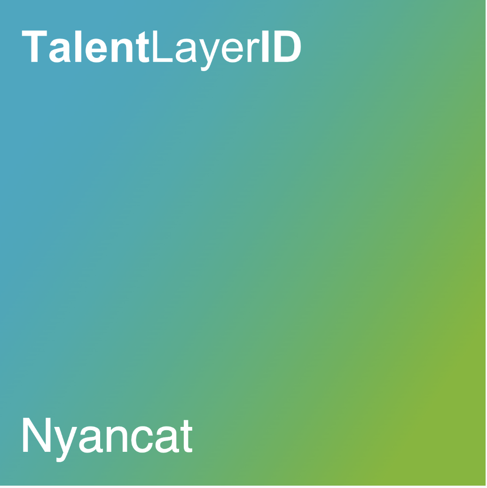

# Creating your TalentLayer ID


**Good to know:** Both parties must create TalentLayer IDs before they are able to initiate a job. This is because you must include your counter-party’s TalentLayer ID Handle in the job invitation.


## Set up your ID

1. **Connect Wallet:** Visit the [indie.talentlayer.org](http://indie.talentlayer.org) and click “Connect Wallet” in the top right corner.
2. **Connect Proof of Humanity (Optional):** Associate your Proof of Humanity identity to your TalentLayer ID. This step is necessary to participate in emergency account recovery.
3. **Choose Your Handle:** Check if a handle is available. Choose your handle.
4. **Create Your ID:** Confirm the creation of your ID and pay a transaction fee.
5. **Save Your Recovery Password:** If you have associated a Proof of Humanity ID to your account, you will receive a recovery password. Store this password in a safe place!

## Learn about Proof of Humanity

Proof of Humanity is a identity system that you can optinally associate with your TalentLayer ID. Learn more about Proof of Humanity:&#x20;


[proof-of-humanity.md](../talentlayer-id/proof-of-humanity.md)

