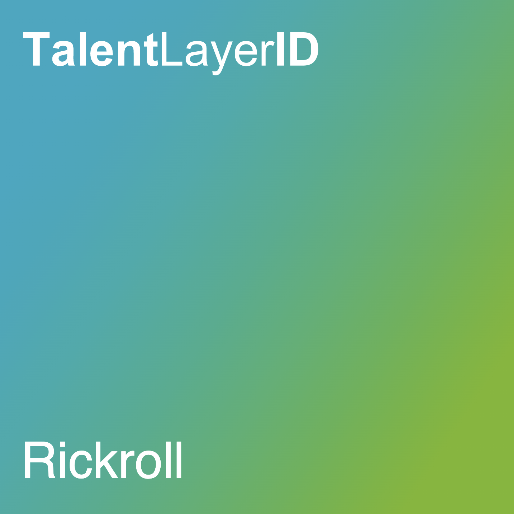

# TalentLayer Id Handle

Your TalentLayer ID Handle is a unique string of characters and numbers that you can choose when you create your TalentLayer ID. This handle is how others can search for your reputation.&#x20;

You can have a maximum of 10 characters in your TalentLayer ID.&#x20;


**Choose wisely:** Make sure you choose your handle carefully - after your ID has been initiated, your handle can not be changed.

