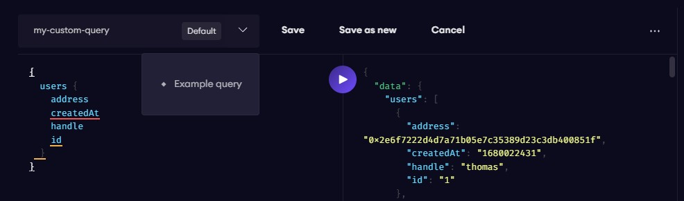
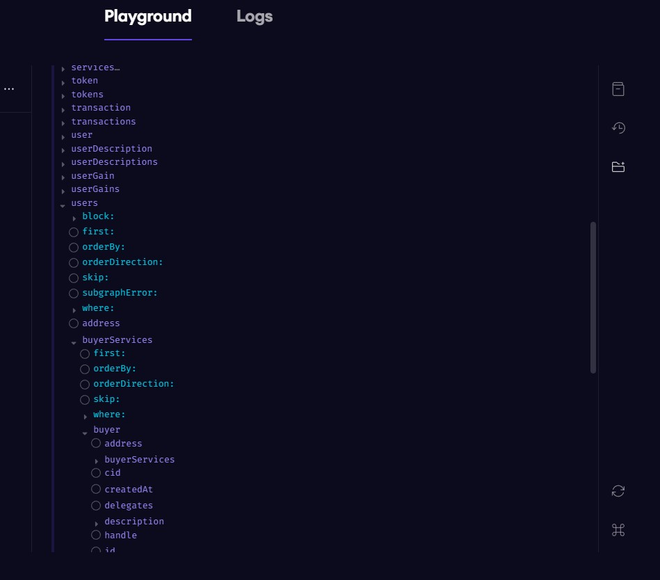

# Introduction

## Exploring the Subgraph

### Subgraph link

* [**Polygon Mumbai Testnet**](https://api.thegraph.com/subgraphs/name/talentlayer/talent-layer-mumbai)
* [**Polygon mainnet**](https://api.thegraph.com/subgraphs/name/talentlayer/talentlayer-polygon)

### Playground Link


To ensure that your queries are working properly before using them in your project, you can use the Graph playground below.


* [**Polygon Mumbai playground**](https://thegraph.com/hosted-service/subgraph/talentlayer/talent-layer-mumbai)
* [**Polygon mainnet pLayground**](https://thegraph.com/hosted-service/subgraph/talentlayer/talentlayer-polygon)

Please check the demo video just below\
[how to test queries with The Graph Playground](https://loom.com/share/a95f65ebe9da4bd1908ca6aacf0b765b)


Using the playground, you can create and save your own graphQL queries and try out the default queries **we provide to get you up and running!**


<figure><figcaption></figcaption></figure>


On the right-hand side, you have access to some neat functionality that will help you explore the subgraph. Check out **GraphQL Explorer** as well as **Documentation Explorer** to create customized queries on the fly!


<figure><figcaption></figcaption></figure>

### **An Introduction to Writing GraphQL Queries for the Talent Layer Subgraph**

The most commonly used entities have a related description entity that stores the off-chain data hosted on [IPFS](https://www.ipfs.com/).

| On-chain Entity | Off-chain Entity    |
| --------------- | ------------------- |
| Service         | ServiceDescription  |
| Proposal        | ProposalDescription |
| Review          | ReviewDescription   |
| User            | UserDescription     |
| Platform        | PlatformDescription |

The off-chain entity that is related to an on-chain entity can be accessed through the field description. Here is an example of what the relationship looks like in GraphQL.

```graphql
{
  services {
    id
    description {
      id
    }
  }
}gr
```


This same pattern can be applied to other entities by simply changing **services** to either **users, proposals, reviews,** or **platforms.**


