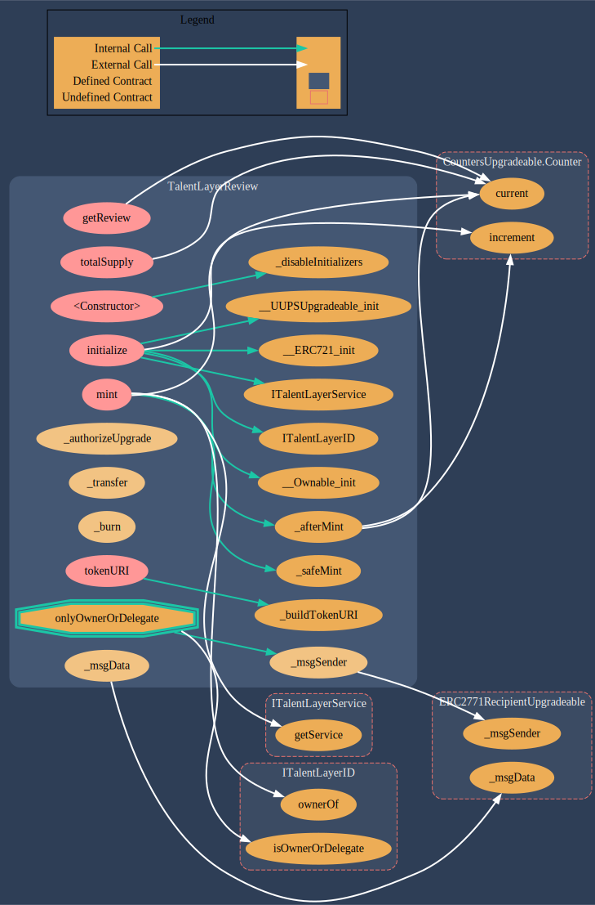

# TalentLayerReview.sol

[**TalentLayerReview.sol**](https://github.com/TalentLayer/talentlayer-id-contracts) is the smart contract that handles reviews written to users' TalentLayer IDs. Reviews are minted as NFTs.

It can used to:

* Mint a review to a user for a completed job
* Look up reviews

## Data Structure

.png>)

## Visualization

<figure><figcaption></figcaption></figure>

## Learn More

Learn more about why we have Reviews and how they function in workflows:&#x20;


[reviews-and-reputation.md](../../../introduction/basics/reviews-and-reputation.md)

