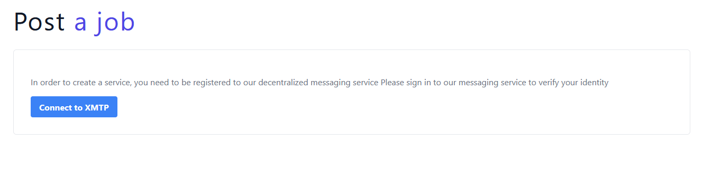

# Integrating XMTP

When studying a service or a proposal, it is important for users to be able to communicate with the author. TalentLayer provides an integration example of XMTP, a messaging system that allows users to communicate with each other using their ETH address. This guide will show you how to integrate the XMTP messaging system into your DAPP.


## Techincal overview

XMTP is based on asymmetric encryption. When u user signs up using his ETH address, he is prompted to use his wallet signature to generate a pair of Private/Public keys. The private key is stored on chain, and requires the user's wallet signature to be retrieved; whereas the public key is stored publicly on chain.
The public key is available to other XMTP users who wish to communicate with this user, and is used to encrypt messages before sending them. The private key is used to decrypt messages.
The sender's public key is included in the message so that the recipient can verify the sender's identity.


## Workflow

When registering to XMTP, wallet signature is required to register the wallet as a User.


(This will be asked only once).

Then for each login, a wallet signature will be asked to decrypt this Private Key and create an XMTP client based on this key.
Messages are stored on XMTP private nodes for now, but will be stored in a decentralized manner in a near future.

## SDK analysis
XMTP provides a [complete SDK](https://xmtp.org/docs/client-sdk/javascript/concepts/intro-to-sdk) to interact with the XMTP protocol.


---


### 1. Client
All calls to XMTP protocol are done through the XMTP [Client](https://xmtp.org/docs/client-sdk/javascript/reference/classes/Client):
This Client is used to retrieve the keys of the user using his wallet signature, and use them to initialize a functional client that can be used to send and receive messages.

```typescript
import { Client } from '@xmtp/xmtp-js';

const keys = await Client.getKeys(signer, { env: 'production' });
const client = await Client.create(null, {
  env: 'production',
  privateKeyOverride: keys,
});
```

---


### 2. Conversations
The Client can be used to create a conversation with another user, and send messages to this conversation.
A conversation is an object gathering all the contextual data related to a conversation between two users,
as well as functions used to send and receive messages as well as websocket listeners, used to stream incoming messages.

```typescript
export declare class ConversationV2 {
  topic: string;
  keyMaterial: Uint8Array;
  context?: InvitationContext;
  private header;
  private client;
  peerAddress: string;
  constructor(client: Client, invitation: InvitationV1, header: SealedInvitationHeaderV1, peerAddress: string);
  static create(client: Client, invitation: InvitationV1, header: SealedInvitationHeaderV1): Promise<ConversationV2>;
  get createdAt(): Date;
  /**
   * Returns a list of all messages to/from the peerAddress
   */
  messages(opts?: ListMessagesOptions): Promise<DecodedMessage[]>;
  messagesPaginated(opts?: ListMessagesPaginatedOptions): AsyncGenerator<DecodedMessage[]>;
  /**
   * Returns a Stream of any new messages to/from the peerAddress
   */
  streamMessages(): Promise<Stream<DecodedMessage>>;
  /**
   * Send a message into the conversation
   */
  send(content: any, // eslint-disable-line @typescript-eslint/no-explicit-any
       options?: SendOptions): Promise<DecodedMessage>;
  get clientAddress(): string;
  private encodeMessage;
  decodeMessage(env: messageApi.Envelope): Promise<DecodedMessage>;
}

export declare type InvitationContext = {
    conversationId: string;
    metadata: {
      [k: string]: string;
  };
};
```

Example of retrieving a list of a user's conversation:
(The client being already initialized with the user's private key)

```typescript
const listConversations = async (): Promise<Conversation[]> => {
    try {
      const conv: Conversation[] = (await client.conversations.list());
    } catch (e) {
      console.error(e);
    }
    return conv;
    };
```


---

### 3. Messages
The client object has a “conversations.list()” function, which once called, returns an array of “Conversation” objects:
The conversation object has a “messages()” function, which once called, returns an array of “DecodedMessage” objects:


```typescript
export declare class DecodedMessage {
  id: string;
  messageVersion: 'v1' | 'v2';
  senderAddress: string;
  recipientAddress?: string;
  sent: Date;
  contentTopic: string;
  conversation: Conversation;
  contentType: ContentTypeId;
  content: any;
  error?: Error;
  constructor({ id, messageVersion, senderAddress, recipientAddress, conversation, contentType, contentTopic, content, sent, error, }: DecodedMessage);
  static fromV1Message(message: MessageV1, content: any, // eslint-disable-line @typescript-eslint/no-explicit-any
                       contentType: ContentTypeId, contentTopic: string, conversation: Conversation, error?: Error): DecodedMessage;
  static fromV2Message(message: MessageV2, content: any, // eslint-disable-line @typescript-eslint/no-explicit-any
                       contentType: ContentTypeId, contentTopic: string, conversation: Conversation, error?: Error): DecodedMessage;
}
```

The message itself is stored in “content”.

Example of retrieving a list of conversation's messages:
(The client being already initialized with the user's private key)

```typescript
import {DecodedMessage} from "@xmtp/xmtp-js";

const listMessages = async (): Promise<DecodedMessage[]> => {
  try {
    const messages: DecodedMessage[] = await conversation.messages();
  } catch (e) {
    console.error(e);
  }
  return messages;
};
```

---

### 4. Sending messages
Sending a message is done through the Conversation object.
The client object has a “conversations.newConversation(peerAddress, context?)” function, which once called, returns a “Conversation” object.
The "context" object is optional, and can be used to add contextual data to the conversation, such as a conversation ID, or any other metadata.
Further details on what TalentLayer implemented can be found in the SDK usage section.

Exemple of sending a message without context:
```typescript
const sendMessage = async (message: string): Promise<DecodedMessage> => {
  const conversation = await client.conversations.newConversation(peerAddress);
  return await conversation.send(message);
};
```

---


### 5. Websocket listeners
There are 2 websocket listeners available in the SDK:
- “client.conversations.stream()” Available from the client object, which streams incoming conversations to the user
- “conversation.streamMessages()” Specific for each conversation, which streams incoming messages to the user

Example of using the client conversation stream:

```typescript
import {Conversation} from "@xmtp/xmtp-js";

const streamConversations = async () => {
  const stream: Stream<Conversation> | undefined = await providerState.client?.conversations.stream();
  if (!stream) return;
  for await (const conversation: Conversation of stream) {
  // Your logic here
  }
};
```

Example of using the message stream:

```typescript
const streamMessages = async (conversation: Conversation) => {
const stream: Stream<DecodedMessage> | undefined = await conversation.streamMessages();
  if (!stream) return;
  for await (const message: DecodedMessage of stream) {
  // Your logic here
  }
};
```

---


## SDK Usage in TalentLayer Indie Frontend

TalentLayer Indie Frontend provides an example implementation of the XMTP protocol in a marketplace.
This document will explain how the SDK was used in the Indie Frontend, and how XMTP was integrated in the workflow.


### 1. Getting started - Workflow
The idea is to enable TalentLayer users to send messages to each other, and to be able to chat with each other **after they published either a service or a proposal**.
Since Users cannot be messaged if they are not registered to XMTP, the first step for a user wishing to publish a service or a proposal is to register to XMTP.

#### 1.1. Registering to XMTP
This box will appear on the user's profile page if they are not registered to XMTP:



After clicking on the button, a modal will appear, asking the user to sign a message with their wallet, which will register them to XMTP.

#### 1.2. Contacting a user
Contacting a user is done by clicking on the "Contact" button either on the service or proposal detail page:

Example on a service detail page:


Clicking on this button will open the messaging page, with the existing or new conversation with the user already opened.
This action will prompt the user to register to XMTP if they are not yet registered.


---


### 2. File Organization & code
TalentLayer has implemented 2 messaging protocols in the Indie Frontend: XMTP and PUSH. Some React components are common to both, and can be found in the "messaging" folder.
All XMTP-related components can fe found in the "mesaging/XMTP" folder.


The messaging page's code is located in the "pages/XmtpMessaging.tsx" file. This is the entry point to the XMTP messaging app.
It is available at the following routes:

```tsx
  <Route path='/messaging' element={<XmtpMessaging />} />
  <Route path='/messaging/:address' element={<XmtpMessaging />} />
```

The first route leading to the messaging page is the default route, and will display the list of conversations.
The second route is used to display a specific conversation, and is used when clicking on a conversation in the list.


#### 2.1. Environment variables
The XMTP SDK requires 2 environment variables to be set in order to work properly. These variables are set in the .env file.

```dotenv
# MESSENGING
VITE_MESSENGING_TECH='xmtp'
VITE_MESSENGING_ENV='production'
```

#### 2.2. General messaging Context
As mentioned before, the workflow starts by checking whether the user has an XMTP account.
If not, he will be prompted to register to XMTP. Finally the user will be redirected to the messaging page, with an open conversation with the recipient.

THis requires that a few actions must happen as pre-requisites:
- The user must have a TalentLayer ID and an XMTP user.
- The user must be registered to XMTP.
These actions happen outside the messaging page; therefore we centralized all the functions necessary for these actions in a general Messaging React context provider: "MessagingContext.tsx".
This context handles both XMTP & Push protocols following actions:

- Check if the user has an XMTP account ` userExists = (): boolean`
  This is done by checking the 'userExists" variable in the XmtpContext.tsx file (detailed in XmtpContext section below)
- Register the user to XMTP if needed | `handleRegisterToMessaging = async (): Promise<void>`
- Redirect the sender to the messaging page, with an open conversation with the recipient | `handleMessageUser = async (userAddress: string): Promise<void>`

Example of redirection to an open conversation with a user:


#### 2.3. XMTP messaging Context

**Content**

The XMTP messaging context is used to handle all the XMTP-related actions which happen in the messaging page, such as retrieving conversations & messages, sending messages, etc.
It can be found in the "messaging/context/XmtpContext.tsx" file.

The following properties are available in this context:

```typescript
interface IProviderProps {
  client: Client | undefined;
  initClient: ((wallet: Signer) => Promise<void>) | undefined;
  loadingConversations: boolean;
  loadingMessages: boolean;
  conversations: Map<string, Conversation>;
  conversationMessages: Map<string, XmtpChatMessage[]>;
  userExists: boolean;
  disconnect: (() => void) | undefined;
}
```

At the initialisation of the context, as soon as the user connects his wallet, a listener is set up to check if the user has an XMTP account:

```typescript
useEffect(() => {
    const checkUserExistence = async (): Promise<void> => {
      if (signer) {
        const userExists = await Client.canMessage(walletAddress as string, {
          env: import.meta.env.VITE_MESSENGING_ENV,
        });
        setProviderState({ ...providerState, userExists, initClient });
      }
    };
    checkUserExistence();
  }, [signer]);
```

If the user does not have an XMTP account, the "userExists" variable will be set to false. This variable is called in the MessagingContext.tsx file, to check if the user needs to be registered to XMTP.


**Client Initialisation**

The first action to be done in the messaging page is to initialize the XMTP client. This is done using the "initClient" function, which takes the user's wallet "Signer" object as a parameter.
After this function is called, the user will get his private keys using his wallet signature, and the "client" object will be set in the context, with the connected user's private key.
This initialized client instance will be used to retrieve conversations, messages, etc.

```typescript
const initClient = async (wallet: Signer) => {
//(...)
}
```


**Conversation & messages loading**

After the client is initialized, the messaging context will load all the user's conversations and messages.
This is done through the following function:

```typescript
const listConversations = async (): Promise<void> => {
//(...)
}
```

Conversations will be accessible through the "conversations" variable, and messages through the "conversationMessages" variable after this step.


**XmtpChatMessage**
During the loading of the conversation's messages, the messages are converted to a custom type: "XmtpChatMessage", which is lighter than the "DecodedMessage" type from the XMTP SDK.
This action is done through the function "buildChatMessage" in the "messaging/utils.ts" file.
This message conversion is also done in the message & conversation listeners (see below).


#### 2.3. XMTP hooks

We provide 3 hooks to help you use the XMTP messaging context in your components:

**UseSendMessage**

This hook is used to send a message to a user. It will first instantiate a new conversation use its "send()" function.
The hook takes the following parameters:

```typescript
 const sendMessage = async (message: string): Promise<DecodedMessage> => {
    if (!client || !peerAddress || !peerUser?.id || !senderId) {
      throw new Error('Message sending failed');
    }

    const conversationId = buildConversationId(senderId, peerUser.id);

    const context: InvitationContext = {
      conversationId: conversationId,
      metadata: { ['domain']: 'TalentLayer' },
    };
    const conversation = await client.conversations.newConversation(peerAddress, context);

    if (!conversation) throw new Error('Conversation not found');
    return await conversation.send(message);
  };

    export const CONVERSATION_PREFIX = 'talentLayer/dm';
    
    export const buildConversationId = (talentLayerId1: string, talentLayerId2: string) => {
      const profileIdAParsed = parseInt(talentLayerId1, 16);
      const profileIdBParsed = parseInt(talentLayerId2, 16);
    
      return profileIdAParsed < profileIdBParsed
        ? `${CONVERSATION_PREFIX}/${talentLayerId1}-${talentLayerId2}`
        : `${CONVERSATION_PREFIX}/${talentLayerId2}-${talentLayerId1}`;
    };
```

Notice the "buildConversationId" function. TalentLayer decided to set a context to the conversations initiated on TalentLayer protocol.
There are several reasons for this decision, the first being to enable filtering out all XMTP conversations which are not TalentLayer-related.
The second reason is to enable the user to have multiple conversations with the same user, but on different topics. this can be achieved using the "metadata" field in the context.
(An example 'domain' field is shown in the code snippet above)

The way the conversationId is built **[follows the pattern which Lens protocol used](https://xmtp.org/docs/client-sdk/javascript/tutorials/build-key-xmtp-chat-features-in-a-lens-app#build-the-lens-dm-conversation-id)**. This way the domain name can be clearly visible in the XMTP general chat app:

TalentLayer decided to filter out all conversations which are not TalentLayer-related, by filtering out all conversations which id's do not match the TalentLayer pattern (see "listConversations" function in XMTPContext.tsx).


This hook is used in the main messaging page, and sets up a "send" function with the selected recipient when the user clicks on its conversation on the left sidebar.

**UseStreamConversations**

This hook sets up a conversation listener to retrieve all the new conversations which are initiated by users trying to contact the connected user.
It takes no parameters and is called in the main messaging page.

**UseStreamMessages**

This hook sets up a message listener to retrieve all the new incoming messages of a conversation.
It is used in the "MessageList.tsx" component, and is only active on an active conversation.


#### 2.4. XMTP messaging components

The main messaging page is located in the "pages/XmtpMessaging.tsx" file.
The page is built using all the components located in the "messaging/xmtp/components" folder.

It's important to activate the conversation listener on this page to retrieve all the new conversations initiated by other users.

Each time a user selects a conversation, the conversation messages are fetched, the "MessageList" component is rendered and the "useSendMessage" hook is called to set up a "send" function to send messages to the selected user.
The "MessageList" component is also responsible for activating the message listener on the selected conversation, since new incoming messages are only listened for the active conversation.

**Components**

The main messaging page is built using the following components:
- CardHeader
- ConversationList
- MessageList
- MessageComposer

CardHeader is a simple component which displays the address of the recipient user.
ConversationList is a component which displays all the user's conversations, and is used to select a conversation. It is also responsible for activating the conversation listener.
MessageList is a component which displays all the messages of a conversation, and is responsible for activating the message listener. This component not rendered message when no conversation is selected.
MessageComposer is a component which displays a text input to send messages to the selected user.
