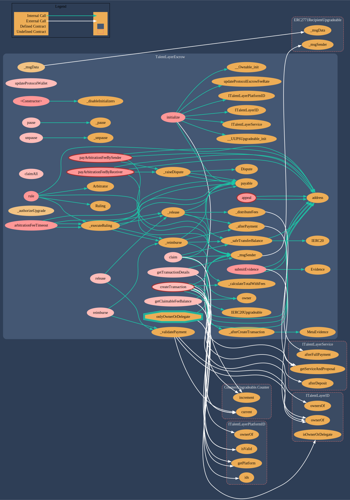
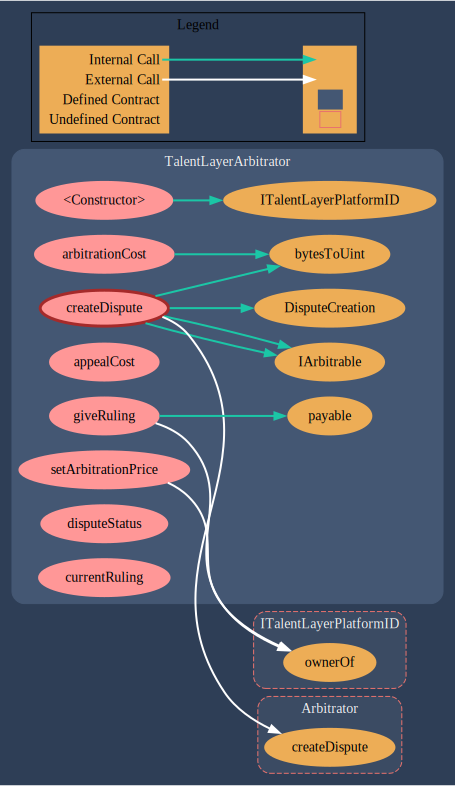

# Escrow & Dispute Contracts

[**TalentLayerEscrow.sol**](https://github.com/TalentLayer/talentlayer-id-contracts/blob/main/contracts/TalentLayerEscrow.sol) is the smart contract that handles escrow transactions for each service, it custody the money and allow hirer to release the money by milestone. Also, in case of a dispute it handle all the workflow and link with the configured arbitrator.&#x20;

It can used to:

* Validate a proposal for a given service and deposit the money
* Release money for the worker&#x20;
* Let the worker reimburse the hirer
* Raise a dispute
* As a platform, claim the fees earned

## Data Structure

.png>)

## Visualization: TalentLayerEscrow.sol

<figure><figcaption></figcaption></figure>

## Visualization: TalentLayerArbitrator.sol

<figure><figcaption></figcaption></figure>

## Learn More

Learn more about our escrow and dispute system and how they function in workflows:&#x20;


[escrow-and-dispute](escrow-and-dispute/)

