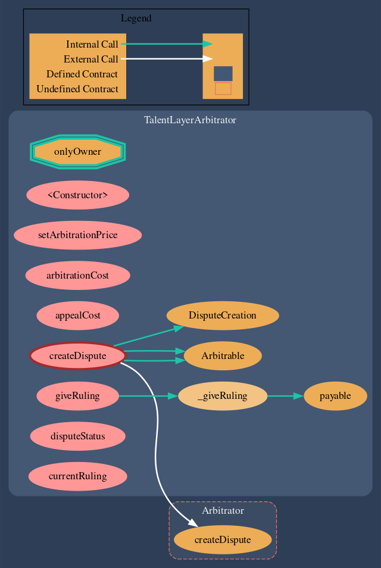

# Escrow & Dispute Contracts

## Contracts

All contracts associated with Escrow and Dispute Resolution are available in their parent folder here:&#x20;



| Contract on Github                                                                                                                 | Use                                                                                                                                                                                                |
| ---------------------------------------------------------------------------------------------------------------------------------- | -------------------------------------------------------------------------------------------------------------------------------------------------------------------------------------------------- |
| [TalentLayerArbitrator.sol](https://github.com/TalentLayer/talentlayer-id-contracts/blob/main/contracts/TalentLayerArbitrator.sol) | TalentLayerArbitrator contract initiates the judgment process for the TalentLayerMultipleArbitrableTransaction contracts. Arbitrator contracts give rulings and Arbitrable contracts enforce them. |
| [TalentLayerEscrow.sol](https://github.com/TalentLayer/talentlayer-id-contracts/blob/main/contracts/TalentLayerEscrow.sol)         | This is the actual escrow contract - here all pertinent functions that must be called to manage escrow transactions can be found.                                                                  |
| [ITalentLayerEscrow.sol](https://github.com/TalentLayer/talentlayer-id-contracts/blob/main/contracts/ITalentLayerEscrow.sol)       | Arbitrator Interface contract for TalentLayerMultipleArbitrableTransaction.sol                                                                                                                     |
| Arbitrable.sol                                                                                                                     | A standard contract that can be judged against by an Arbitrator contract.                                                                                                                          |
| Arbitrator.sol                                                                                                                     | Arbitrator contracts initiate the judgment process for Arbitrable contracts. Arbitrator contracts give rulings and Arbitrable contracts enforce them.                                              |
| IArbitrable.sol                                                                                                                    | Arbitrator Interface contract.                                                                                                                                                                     |

## Visualization: TalentLayerEscrow.sol

<figure><figcaption>
made with <a href="https://marketplace.visualstudio.com/items?itemName=tintinweb.solidity-visual-auditor">Solidity Visual Developer</a> plugin
</figcaption></figure>

## Visualization: TalentLayerArbitrator.sol

<figure><figcaption>
made with <a href="https://marketplace.visualstudio.com/items?itemName=tintinweb.solidity-visual-auditor">Solidity Visual Developer</a> plugin
</figcaption></figure>

## Learn More

Learn more about our escrow and dispute system and how they function in workflows:&#x20;


[escrow-and-dispute](escrow-and-dispute/)

