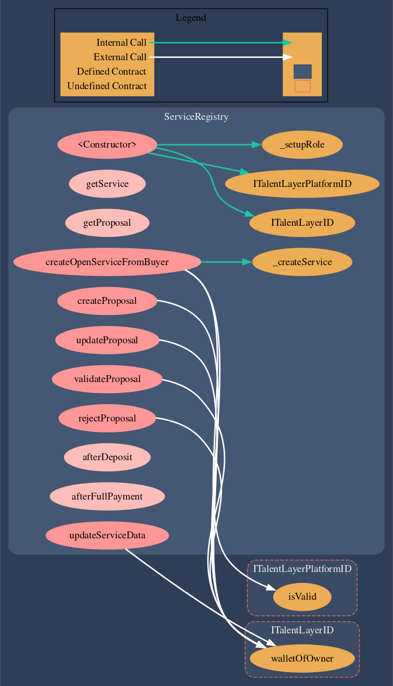

# ServiceRegistry.sol

[**ServiceRegistry.sol**](https://github.com/TalentLayer/talentlayer-id-contracts/blob/main/contracts/ServiceRegistry.sol) is the smart contract that creates an instance of a Services and associates Proposals with that service as they are submitted. Services and Proposals are not minted as NFTs - rather, their data is stored in an on-chain registry within the smart contract. Services and Proposals can be deleted or updated easily.

### Service Status

Services are assigned different statuses based on the stage of the service lifecycle they are in.

```
    enum Status {
        Filled, /// The service has been assigned to an employee
        Confirmed, /// The service has been consented to by an employee
        Finished, /// (if no escrow) The service has been market completed by an employer or (if escrow) escrow has been released 
        Rejected, /// The service has been removed by the employer
        Opened /// The service has been created, but not assigned to an employee
    }
```

## Visualization

<figure><figcaption><p>made with <a href="https://marketplace.visualstudio.com/items?itemName=tintinweb.solidity-visual-auditor">Solidity Visual Developer</a> plugin</p></figcaption></figure>

## Learn More

Learn more about why we have the Service Registry and how it functions in workflows:&#x20;


[jobs-and-proposals.md](../../basics/elements/jobs-and-proposals.md)

