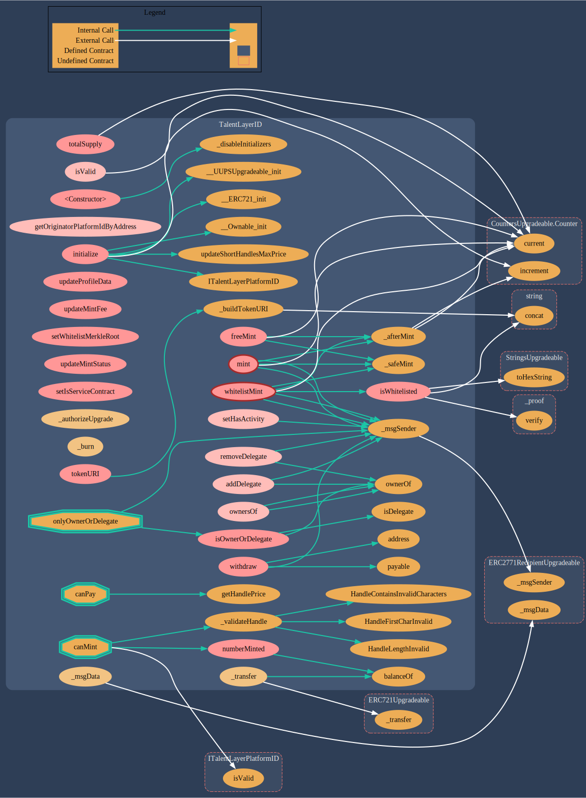

# TalentLayerID.sol

[**TalentLayerID.sol**](https://github.com/TalentLayer/talentlayer-id-contracts/blob/main/contracts/TalentLayerID.sol) is the smart contract that initializes a user's TalentLayer ID. The contract can be used to:

* Mint a TalentLayer ID
* Update profile off-chain data&#x20;
* Transfer the NFT if there is no activity linked to it
* A TalentLayerID can delegate right to another address to execute transaction on the protocol (for example to pay for gas fees, or to automatize release)

## Data Structure

### .png>)

## Visualization

<figure><figcaption></figcaption></figure>

## Learn More

Learn more about why we have TalentLayer IDs and how they function in workflows:&#x20;


[what-is-talentlayer-id.md](../basics/what-is-talentlayer-id.md)

