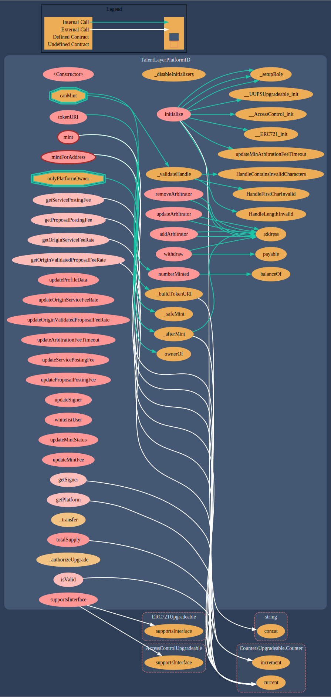

# TalentLayerPlatformID.sol

## **About The Contract**

[**TalentLayerPlatformID.sol**](https://github.com/TalentLayer/talentlayer-id-contracts/blob/main/contracts/TalentLayerPlatformID.sol) is the contract that initializes an integrating platforms' ID. The contract can be used to:

* Mint a PlatformID
* Update platform off-chain data&#x20;
* Manage platform fees
* Manage dispute resolution strategy for the platform&#x20;
* Activate signing mechanism on service and proposal posting

## Data Structure

.png>)

## Visualization

<figure><figcaption></figcaption></figure>

## Learn More

Learn more about why we have Platform IDs and how to get one here:


[platformid.md](../basics/platformid.md)

