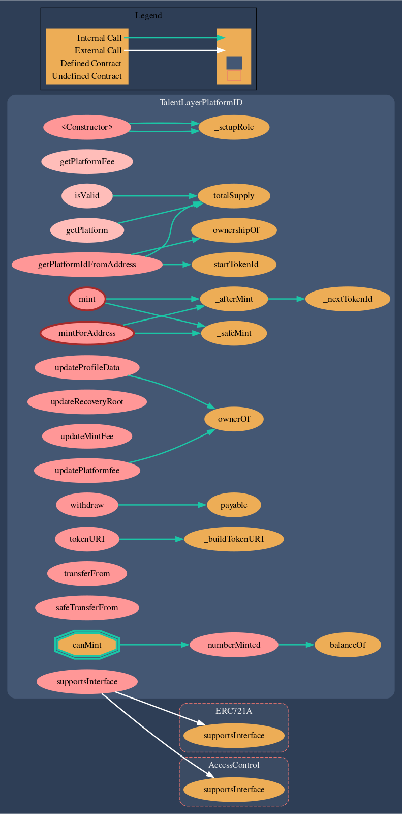

# TalentLayerPlatformID.sol

## **About The Contract**

****[**TalentLayerPlatformID.sol**](https://github.com/TalentLayer/talentlayer-id-contracts/blob/main/contracts/TalentLayerPlatformID.sol) **** is the contract that initializes an integrating platforms' ID. The contract can be used to:

* Mint a PlatformID
* Initiate account recovery process
* Manage platform fees


More info coming soon!


## Visualization

<figure><figcaption>
made with <a href="https://marketplace.visualstudio.com/items?itemName=tintinweb.solidity-visual-auditor">Solidity Visual Developer</a> plugin
</figcaption></figure>

## Learn More

Learn more about why we have Platform IDs and how to get one here:


[platformid.md](../../basics/elements/platformid.md)

