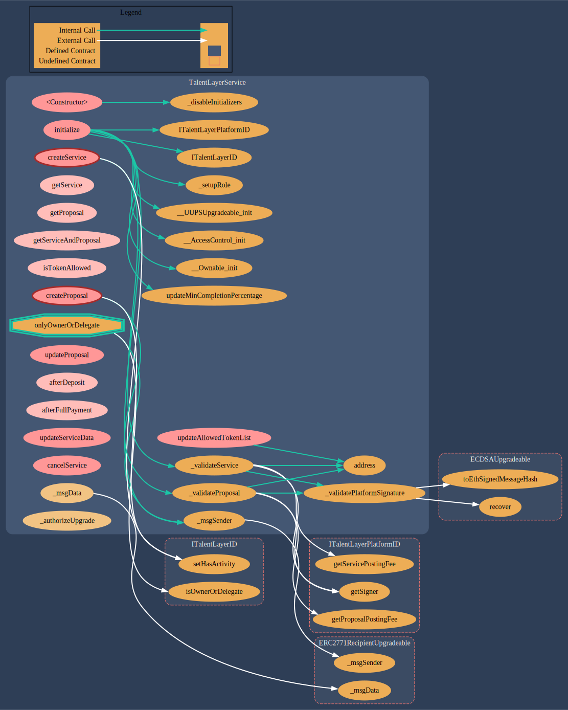

# TalentLayerService.sol

[TalentLayerService.sol](https://github.com/TalentLayer/talentlayer-id-contracts/blob/main/contracts/TalentLayerService.sol) is the smart contract that creates an instance of a Services and associates Proposals with that service as they are submitted. Services and Proposals are not minted as NFTs - rather, their data is stored in an on-chain registry within the smart contract. Services and Proposals can be deleted or updated easily. The contract can be used to&#x20;

* Create a new service&#x20;
* Add a proposal for a open service&#x20;
* update a service or a proposal&#x20;

## Data Structure

.png>)

## Visualization

<figure><figcaption></figcaption></figure>

## Learn More

Learn more about why we have the Service Registry and how it functions in workflows:&#x20;


[jobs-and-proposals.md](../../basics/elements/jobs-and-proposals.md)

